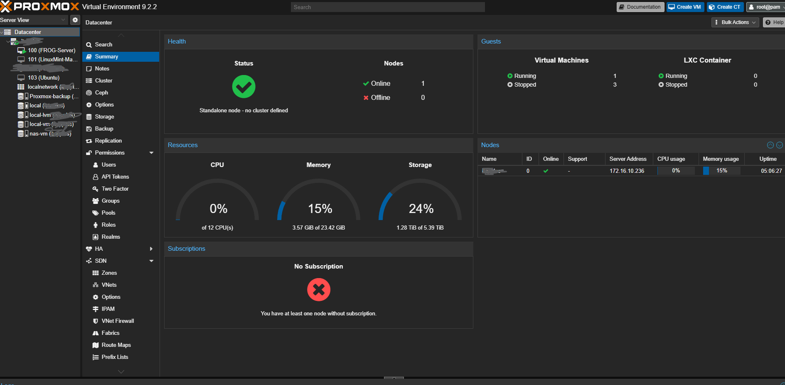
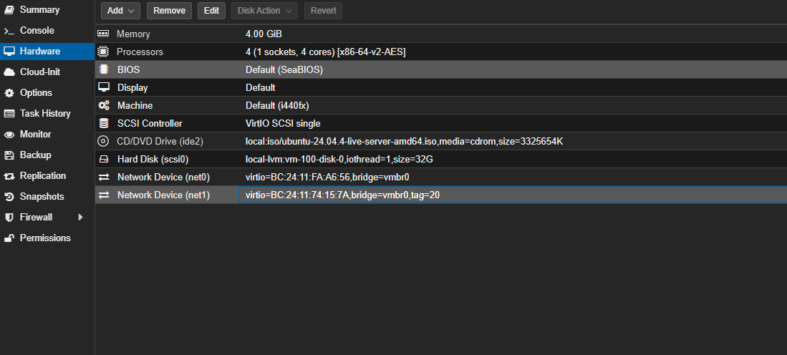
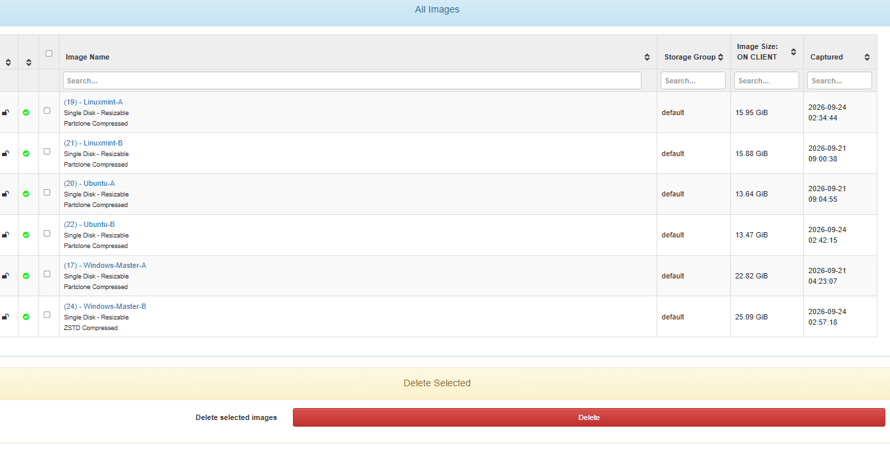
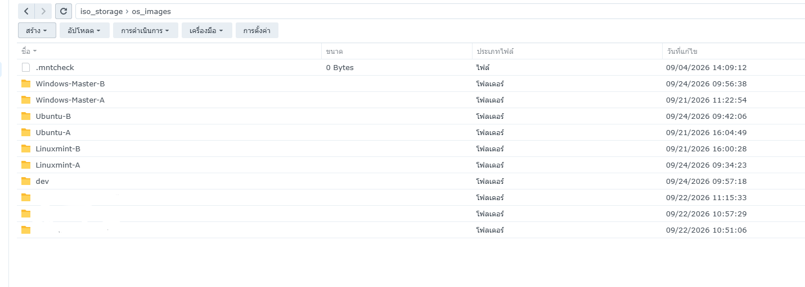
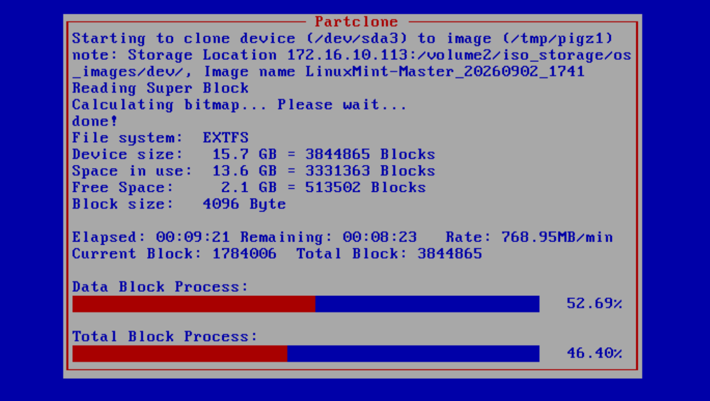
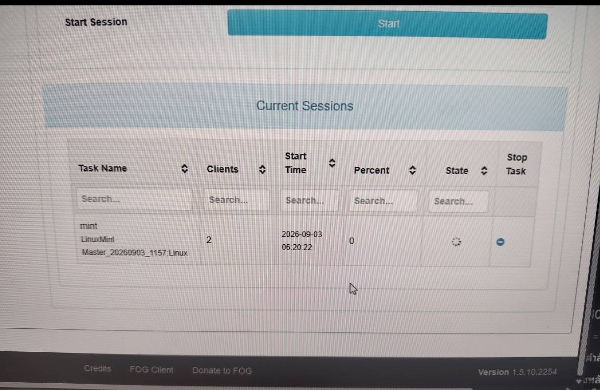
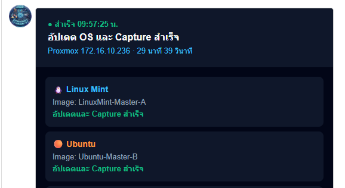

# ระบบจัดการและติดตั้งระบบปฏิบัติการผ่านเครือข่ายด้วย Proxmox VE และ FOG Project

โครงการนี้เป็นส่วนหนึ่งของการปฏิบัติงานสหกิจศึกษา มีวัตถุประสงค์เพื่อพัฒนาระบบสำหรับจัดเตรียมเครื่องต้นแบบ สำรองอิมเมจ และติดตั้งระบบปฏิบัติการให้เครื่องคอมพิวเตอร์ผ่านเครือข่าย ลดขั้นตอนการติดตั้งระบบปฏิบัติการทีละเครื่อง และช่วยให้เครื่องคอมพิวเตอร์ภายในองค์กรมีการตั้งค่าที่เป็นมาตรฐานเดียวกัน

## สิ่งที่พัฒนา

- จัดสร้างเครื่องต้นแบบ Ubuntu และ Linux Mint บน Proxmox VE
- แยกเครือข่ายสำหรับอัปเดตระบบและเครือข่ายสำหรับโคลนระบบด้วย VLAN
- ติดตั้ง FOG Project สำหรับจัดการอิมเมจระบบปฏิบัติการ
- เชื่อมต่อ NAS ผ่าน NFS เพื่อจัดเก็บไฟล์อิมเมจ
- Capture อิมเมจจากเครื่องต้นแบบผ่าน PXE Boot
- Deploy ระบบปฏิบัติการให้เครื่องลูกผ่านเครือข่าย
- รองรับการ Deploy แบบ Unicast และ Multicast
- จัดเก็บอิมเมจแบบ A/B เพื่อเก็บเวอร์ชันก่อนหน้าสำหรับการย้อนกลับ
- พัฒนาสคริปต์สำหรับอัปเดตและ Capture อิมเมจอัตโนมัติ
- แจ้งสถานะการทำงานและข้อผิดพลาดผ่าน LINE Messaging API
- ทดลองติดตั้ง Linux Mint อัตโนมัติเมื่อเครื่องลูกเชื่อมต่อกับพอร์ตเครือข่ายที่กำหนด

## กระบวนการทำงาน

1. เปิดเครื่องต้นแบบบน Proxmox VE
2. เชื่อมต่อเครือข่ายเพื่ออัปเดตระบบปฏิบัติการและโปรแกรม
3. ปิดเครื่องต้นแบบและเปลี่ยนลำดับการบูตเป็น PXE
4. เปิดเครื่องต้นแบบเข้าสู่ FOG Client
5. Capture อิมเมจและจัดเก็บลง NAS
6. ตรวจสอบผลการ Capture และสลับอิมเมจแบบ A/B
7. แจ้งผลการทำงานให้ผู้ดูแลระบบผ่าน LINE
8. นำอิมเมจไป Deploy ให้เครื่องลูกแบบเครื่องเดียวหรือหลายเครื่องพร้อมกัน

## เอกสารโครงการ

- [โครงสร้างและการออกแบบระบบ](docs/architecture.md)
- [ขั้นตอนการทดสอบระบบ](docs/testing.md)
- [แนวทางแก้ไขปัญหา](docs/troubleshooting.md)
- [สคริปต์ Automation](scripts/auto_capture.sh)
- [ตัวอย่างไฟล์ตั้งค่า](config-examples/fog_automation.env.example)


## ภาพรวมระบบ

```text
เครือข่าย
VLAN สำหรับอัปเดตระบบ
        |
        v
Proxmox VE
├── FOG Server
├── Windows Master
├── Ubuntu Master
└── Linux Mint Master
        |
        v
เครือข่าย PXE และ Imaging
        |
        ├── NAS Storage
        └── Client Computers
```

## เทคโนโลยีที่ใช้

- Proxmox VE
- FOG Project
- Linux Mint
- Ubuntu
- PXE และ iPXE
- VLAN
- DHCP และ TFTP
- NFS และ NAS
- Unicast และ Multicast
- Bash Shell Script
- LINE Messaging API

## ผลลัพธ์ของโครงการ

ระบบสามารถจัดเก็บและบริหารอิมเมจของระบบปฏิบัติการหลายประเภทจากศูนย์กลาง สามารถติดตั้งระบบปฏิบัติการให้เครื่องลูกผ่านเครือข่าย และรองรับการติดตั้งหลายเครื่องพร้อมกัน ช่วยลดขั้นตอนการทำงานของเจ้าหน้าที่และลดความแตกต่างของการตั้งค่าระหว่างเครื่องคอมพิวเตอร์

## ข้อจำกัด

- เครื่องลูกต้องรองรับการบูตผ่านเครือข่าย
- ความเร็วในการ Capture และ Deploy ขึ้นอยู่กับเครือข่ายและ NAS
- การ Deploy อัตโนมัติใช้งานเฉพาะ VLAN หรือพอร์ตที่กำหนด

## ความปลอดภัย

Repository นี้จัดเก็บเฉพาะสคริปต์และตัวอย่างการตั้งค่าที่ผ่านการลบข้อมูลสำคัญแล้ว ไม่มี Password, API Token, LINE Token, อิมเมจระบบปฏิบัติการ หรือข้อมูลเครือข่ายจริงขององค์กร

## ภาพตัวอย่างการทำงาน

### เครื่องเสมือนบน Proxmox VE


### การตั้งค่าเครือข่ายและ VLAN


### การจัดการอิมเมจใน FOG Project


### พื้นที่จัดเก็บอิมเมจบน NAS


### ขั้นตอน Capture และ Deploy


### การติดตั้งพร้อมกันแบบ Multicast


### การแจ้งเตือนผ่าน LINE


## วัตถุประสงค์ทางการศึกษา

โครงการนี้จัดทำขึ้นเพื่อประกอบการศึกษาและนำเสนอแนวทางการประยุกต์ใช้ Virtualization, Network Boot, System Imaging, Network Segmentation และ Automation ในงาน IT Infrastructure
